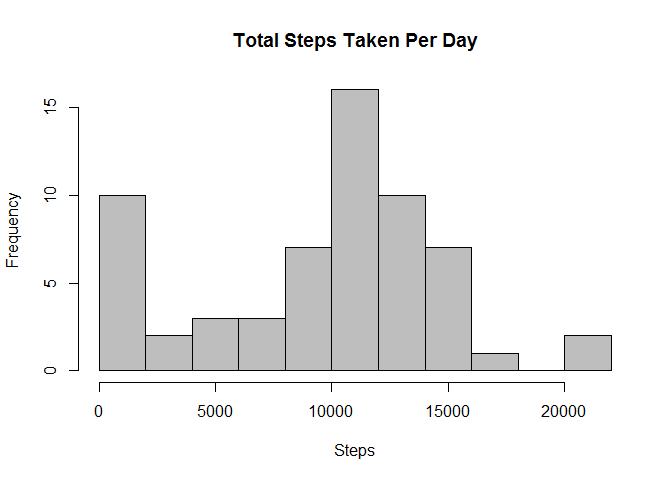
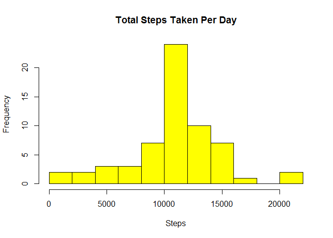

# Reproducible Research: Peer Assessment 1


## Loading and preprocessing the data

First we load the data for the analysis. The data contains information about the number of steps taken by anonymous individuals within 5-minute intervals collected throughout several dates.


```r
data <- read.csv(unz("activity.zip", "activity.csv"))
data$date <- as.Date(data$date, "%Y-%m-%d")
```


## What is mean total number of steps taken per day?


```r
stepsperday <- with(data, tapply(steps, date, sum, na.rm=TRUE))
```


```r
hist(stepsperday, breaks=15, col=16,
     main = "Total Steps Taken Per Day",
     xlab = "Steps", ylab = "Frequency")
```

<!-- -->

The histogram above shows the total number of steps taken per day, ignoring missing values.


```r
meansteps <- mean(stepsperday)
mediansteps <- median(stepsperday)
```

The mean total number of steps taken per day is **9354.2295082** and the median is **10395**.


## What is the average daily activity pattern?

In order to answer this question, we must find the mean number of steps per interval across all dates:


```r
meanstepsperinterval <- with(data, tapply(steps, interval, mean, na.rm=TRUE))
```


```r
plot(names(meanstepsperinterval), meanstepsperinterval, type='l',
     main = "Average Number of Steps Taken per Interval",
     xlab = "Interval", ylab = "Steps")
```

<!-- -->

The plot above is a time series graph of the number of steps taken throughout the day on a typical day.


```r
maxinterval <- names(which.max(meanstepsperinterval))
```

The interval with the highest average number of steps is **835**.

## Imputing missing values


```r
nacount <- sum(is.na(data$steps))
```

The dataset has **2304** missing values. We can deal with missing values by filling them in with the average number of steps for that interval:


```r
newdata <- data
for (i in seq_along(newdata$steps)) {
    if (is.na(newdata$steps[i])) {
        newdata$steps[i] <- meanstepsperinterval[toString(newdata$interval[i])]
    }
}
```

With this filled-in dataset, we construct a histogram:


```r
newstepsperday <- with(newdata, tapply(steps, date, sum))
hist(newstepsperday, breaks=15, col=15,
     main = "Total Steps Taken Per Day",
     xlab = "Steps", ylab = "Frequency")
```

<!-- -->

As seen by the histogram, imputing the missing values with the mean steps of the interval reduced the number of days with 0 steps taken.


```r
newmeansteps <- mean(newstepsperday)
newmediansteps <- median(newstepsperday)
```

The new mean total number of steps taken per day is **1.0766189\times 10^{4}** and the new median is **1.0766189\times 10^{4}**. As you would expect, both the mean and median have increased.

## Are there differences in activity patterns between weekdays and weekends?

To answer this, we must know which of the dates are weekdays and which are weekends. I introduce a new variable in the data called weekend to indicate this information.


```r
library(dplyr)
```

```
## 
## Attaching package: 'dplyr'
```

```
## The following objects are masked from 'package:stats':
## 
##     filter, lag
```

```
## The following objects are masked from 'package:base':
## 
##     intersect, setdiff, setequal, union
```

```r
newdata <- mutate(newdata, weekend = factor(weekdays(date) %in% c("Saturday", "Sunday"), levels=c(TRUE,FALSE), labels=c("Weekend", "Weekday")))
```

With this information, we can calculate the mean steps taken per interval across weekends and weekdays:


```r
splitted <- split(newdata, newdata$weekend)
weekend_df <- splitted[[1]]
weekday_df <- splitted[[2]]

weekendmean <- with(weekend_df, tapply(steps, interval, mean))
weekdaymean <- with(weekday_df, tapply(steps, interval, mean))

weekend_df <- data.frame(cbind(interval = as.numeric(names(weekendmean)), 
                    mean_steps = as.numeric(weekendmean), 
                    weekend = rep(1, length(weekendmean))))
weekday_df <- data.frame(cbind(interval = as.numeric(names(weekdaymean)), 
                    mean_steps = as.numeric(weekdaymean), 
                    weekend = rep(0, length(weekdaymean))))

final_df <- rbind(weekend_df, weekday_df)
rownames(final_df) <- NULL
final_df <- data.frame(final_df)
final_df$weekend <- factor(final_df$weekend, levels=c(1, 0), labels=c("weekend","weekday"))
```


```r
library(lattice)

xyplot(mean_steps ~ interval | weekend, data=final_df, type = 'l', layout=c(1,2),
       xlab="Interval", ylab="Steps")
```

<!-- -->

The plot above shows a time series graph for the number of steps taken throughout the day on your typical weekday and your typical weekend. We can see that there is a bigger spike of steps taken during the weekdays, but the number of steps taken during the weekends is more evenly spread throughout the day. 
